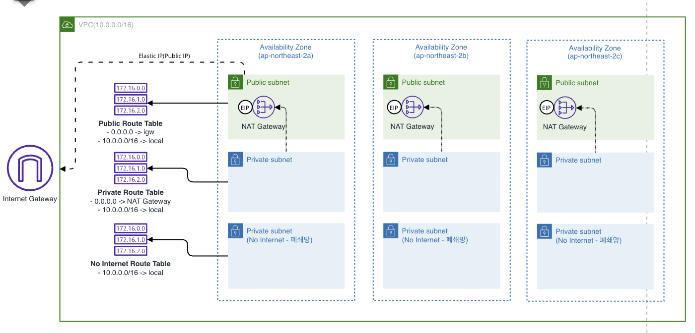

# basic_vpc_with_no_internet_subnet

## Architecture


## Component
```bash
.
├── nat.tf # NAT Gateway definition per AZ
├── routes.tf # Route Table Subnet Association Definition
├── subnets.tf # Public/Private/Air-gapped subnet definition
└── vpc.tf # VPC definition
```

## Key Assertions
- *E2E Connectivity Verification*
  - **Outbound Isolation:** Instances in the air-gapped subnet must be strictly isolated from the public internet (connection timeout expected).
  - **Public Reachability:** Instances in the private subnet must have successful outbound internet access via the Internet Gateway.

## Test Component
```shell
.
├── fixtures
│   ├── ec2.tf # Deploying Private Instance and AirGapped Instance
│   ├── output.tf 
│   ├── ssm_role.tf # SSM Instance Profile for testing
│   └── vpc_endpoint.tf # SSM Endpoints for access air-gapped instance
└── vpc_e2e_test.go
```