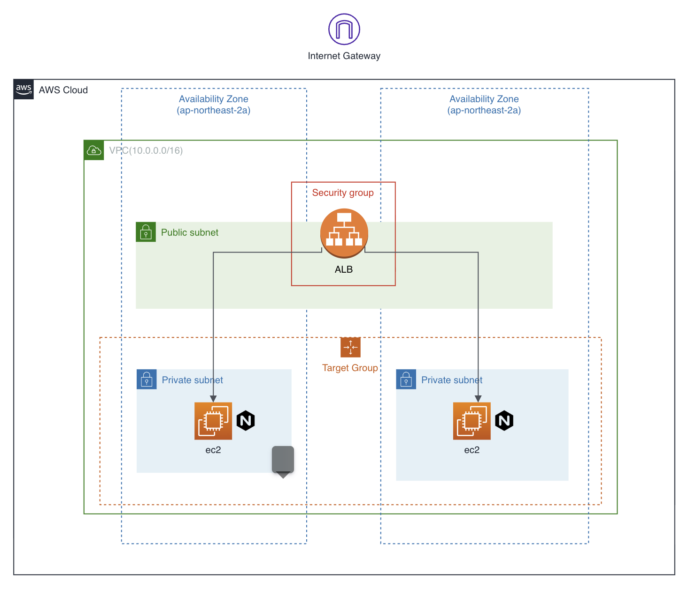

# Instance Basic

## Architecture



## Note
- automatically assigning public IP on EC2(no EIP)
- fetching latest `al2023` AMI
- install nginx via ec2 userdata

## Component
```bash
.
├── alb_sg.tf # Security Group attached to ALB
├── alb.tf # ALB/TargetGroup/TargetGroupBinding/Listener
├── ec2_sg.tf # Security Group Allowes Ingress Traffic from ALB SG
├── ec2.tf # EC2 Instance with Nginx 80 port opened
└── vpc.tf # VPC/NAT/Subnet definition
```

## Key Assertions
- *E2E Connectivity Verification*
  - **Public Reachability:** Nginx service must have successful outbound internet access via the ALB.

## Test Component
```shell
.
└── get_alb_endpoint_test.go
```