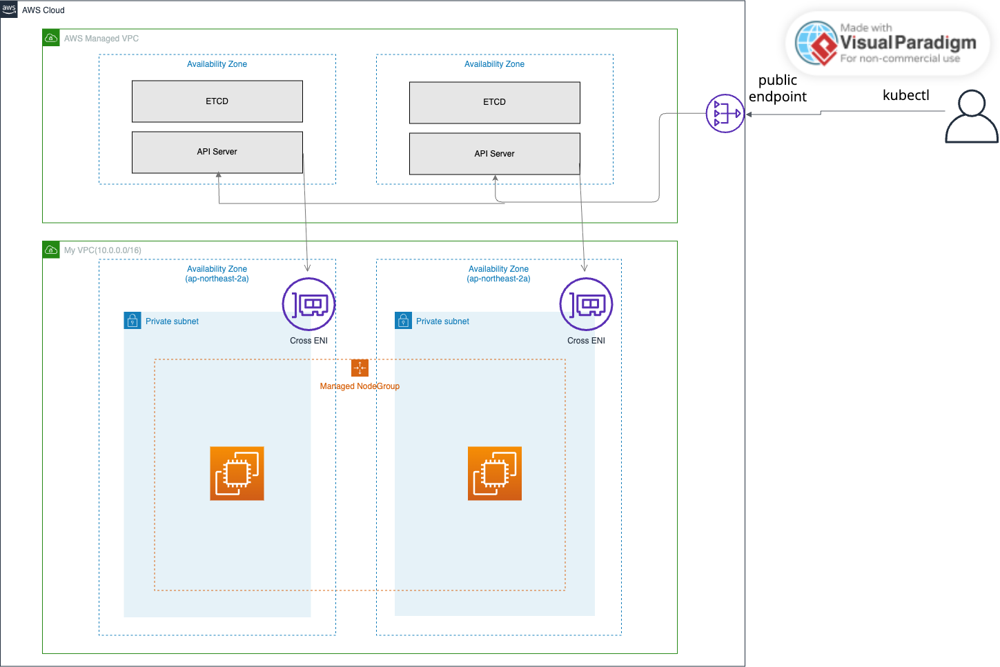

# EKS Basic

## Architecture



## Note
- VPC-CNI addon uses Node's IAM Role instaed of Pod Role(IRSA or Pod Identity)

## Component
```bash
.
├── addon.tf # vpc-cni/coredns/kube-proxy(required addon)
├── cluster.tf # EKS Cluster/ClusterRole
├── mng.tf # Latest AL2023 Nodegroup
├── access_entry.tf # Allow ClusterAdminPolicy to Console/CLI User
└── vpc.tf # VPC/NAT/Subnet definition
```

## Key Assertions
- None

## Test Component
- None