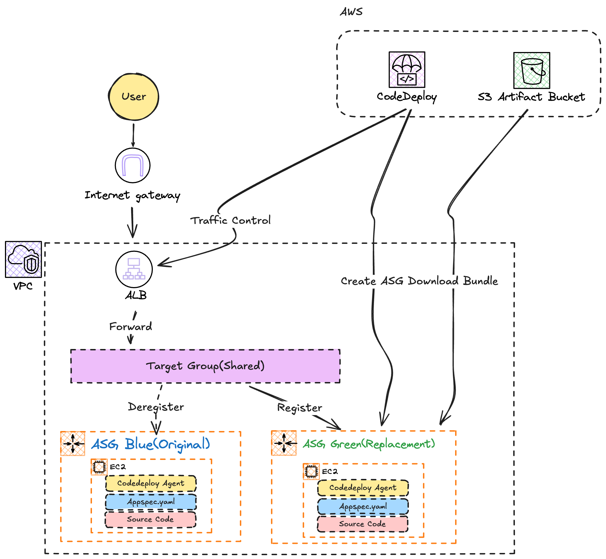

## Architecture



## Note
- **Blue/Green 배포** 방식을 사용하여 무중단 배포를 수행합니다.
- **Application Load Balancer (ALB)** 가 트래픽을 제어하며, 배포 시 새 버전(Green)이 준비되면 트래픽을 전환합니다.
- ALB 보안 그룹(`alb_sg`)은 지정된 Prefix List(`pl-04d32cf3e97374098`)에서만 HTTP(80) 접근을 허용합니다.
- EC2 인스턴스 보안 그룹(`ec2_sg`)은 ALB로부터의 트래픽만 허용하여 보안을 강화했습니다.
- 인스턴스 직접 접근은 **AWS Systems Manager (SSM) Session Manager**를 통해서만 가능합니다.

## Component
```bash
.
├── alb.tf            # Application Load Balancer, Listener, Target Groups (Blue/Green)
├── app/              # 배포할 샘플 애플리케이션 (appspec.yml, scripts, html)
├── asg.tf            # EC2 인스턴스 관리를 위한 Auto Scaling 그룹 (초기 Blue 타겟 그룹 연결)
├── codedeploy_app.tf  # CodeDeploy 애플리케이션 및 배포 그룹 (Blue/Green 방식)
├── codedeploy_lt.tf   # AMI 및 User Data가 포함된 시작 템플릿
├── example.sh        # CodeDeploy Agent 설치를 위한 쉘 스크립트
├── output.tf         # S3 버킷 이름 및 CodeDeploy 리소스 이름 출력
├── provider.tf       # Terraform 프로바이더 및 리전 설정
├── s3.tf             # 배포 아티팩트 저장을 위한 S3 버킷
├── service_role.tf   # CodeDeploy 및 EC2(SSM, ASG, LT, S3)를 위한 IAM 역할 및 정책
├── sg.tf             # 보안 그룹 (ALB: Prefix List 허용, EC2: ALB만 허용)
└── vpc.tf            # VPC, 서브넷(Public/Private), NAT 게이트웨이, 라우팅 테이블 정의
```

## How to Deploy (배포 방법)

1. **인프라 배포**:
    ```bash
    terraform init
    terraform apply -auto-approve
    ```

2. **애플리케이션 패키징**:
    ```bash
    cd app
    zip -r ../app.zip *
    cd ..
    ```

3. **아티팩트 업로드**:
    ```bash
    BUCKET_NAME=$(terraform output -raw s3_bucket_name)
    aws s3 cp app.zip s3://$BUCKET_NAME/app.zip
    ```

4. **배포 생성**:
    ```bash
    APP_NAME=$(terraform output -raw codedeploy_app_name)
    GROUP_NAME=$(terraform output -raw codedeploy_deployment_group_name) 
    
    aws deploy create-deployment \
      --application-name $APP_NAME \
      --deployment-group-name $GROUP_NAME \
      --s3-location bucket=$BUCKET_NAME,key=app.zip,bundleType=zip
    ```
