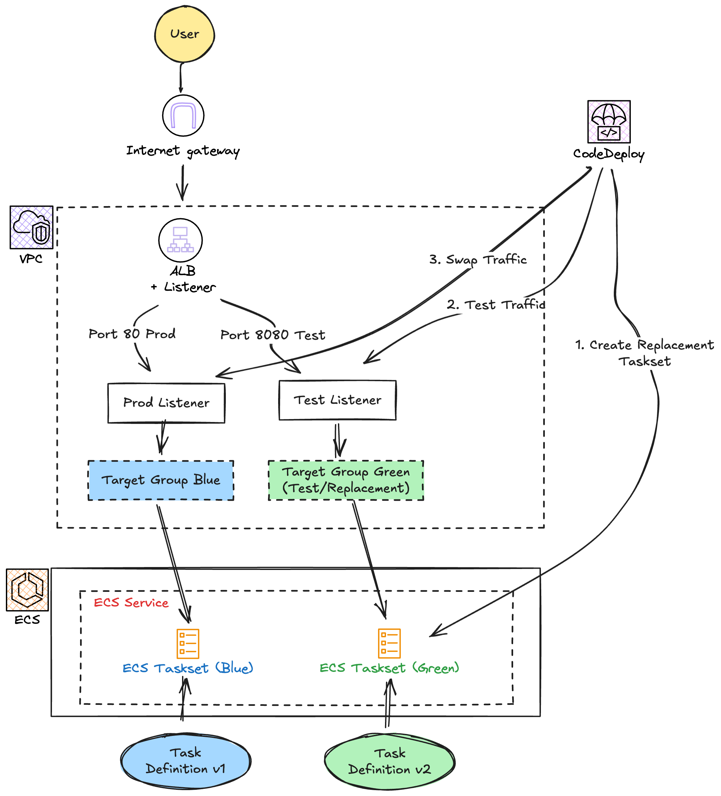

## Architecture



## Note
- **ECS Fargate**와 **CodeDeploy Blue/Green** 배포를 사용합니다.
- **Application Load Balancer (ALB)** 가 트래픽을 제어하며, 두 개의 Target Group(Blue/Green)과 두 개의 Listener(Prod/Test)를 사용합니다.
- 배포 시 트래픽은 Test Listener(8080)로 먼저 라우팅되어 검증 후 Prod Listener(80)로 전환됩니다.
- 보안 그룹은 ALB(80 포트, 지정된 Prefix List 허용)와 ECS(ALB만 허용)로 구성되어 있습니다.

## Component
```bash
.
├── alb.tf            # ALB, Listeners (Prod/Test), Target Groups (Blue/Green)
├── app/              # 배포할 샘플 애플리케이션 (appspec.yml)
├── codedeploy_app.tf  # CodeDeploy 애플리케이션 및 배포 그룹 (ECS Blue/Green)
├── ecs.tf            # ECS 클러스터, 작업 정의, 서비스 (Fargate, CodeDeploy 컨트롤러)
├── output.tf         # 주요 리소스 정보 출력
├── provider.tf       # Terraform 프로바이더 및 리전 설정
├── s3.tf             # 배포 아티팩트 저장을 위한 S3 버킷
├── service_role.tf   # ECS 및 CodeDeploy를 위한 IAM 역할
├── sg.tf             # 보안 그룹 (ALB: Prefix List 허용, ECS: ALB만 허용)
└── vpc.tf            # VPC, 서브넷(Public/Private), NAT 게이트웨이, 라우팅 테이블 정의
```

## How to Deploy (배포 방법)

ECS Blue/Green 배포는 **새로운 Task Definition**을 등록하고, 해당 ARN을 `appspec.yml`에 기재하여 배포를 수행해야 합니다.

1. **인프라 배포**:
    ```bash
    terraform init
    terraform apply -auto-approve
    ```

2. **새로운 Task Definition 등록 (예시)**:
    AWS CLI를 사용하여 새 Task Definition을 등록합니다. (이미지 태그 변경 등)
    
    > **Note:** `jq`가 설치되어 있어야 합니다.
    
    ```bash
    # 현재 Task Definition 조회 및 필요한 필드만 추출
    aws ecs describe-task-definition --task-definition codedeploy-ecs-task \
      | jq '.taskDefinition | {family, taskRoleArn, executionRoleArn, networkMode, containerDefinitions, volumes, placementConstraints, requiresCompatibilities, cpu, memory}' > taskdef.json
    
    # (선택) taskdef.json 수정 (이미지 태그 변경 등)
    # 예: vim taskdef.json
    
    # 새 Task Definition 등록
    NEW_TASK_DEF_ARN=$(aws ecs register-task-definition --cli-input-json file://taskdef.json --query taskDefinition.taskDefinitionArn --output text)
    echo "New Task Definition ARN: $NEW_TASK_DEF_ARN"
    ```

3. **AppSpec 파일 업데이트**:
    `app/appspec.yml` 파일의 `<TASK_DEFINITION>` 부분을 위에서 얻은 `$NEW_TASK_DEF_ARN`으로 변경합니다.
    ```bash
    sed -i "s|<TASK_DEFINITION>|$NEW_TASK_DEF_ARN|g" app/appspec.yml
    ```

4. **애플리케이션 패키징**:
    ```bash
    cd app
    zip -r ../app.zip *
    cd ..
    ```

5. **아티팩트 업로드**:
    ```bash
    BUCKET_NAME=$(terraform output -raw s3_bucket_name)
    aws s3 cp app.zip s3://$BUCKET_NAME/app.zip
    ```

6. **배포 생성**:
    ```bash
    APP_NAME=$(terraform output -raw codedeploy_app_name)
    GROUP_NAME=$(terraform output -raw codedeploy_deployment_group_name) 
    
    aws deploy create-deployment \
      --application-name $APP_NAME \
      --deployment-group-name $GROUP_NAME \
      --s3-location bucket=$BUCKET_NAME,key=app.zip,bundleType=zip
    ```
