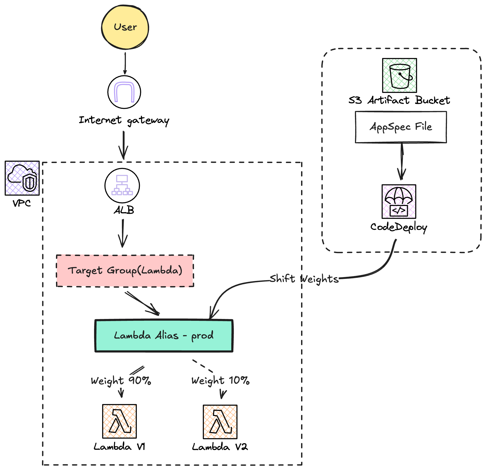

## Architecture



## Note
- **AWS Lambda**와 **CodeDeploy Blue/Green** 배포를 사용합니다.
- **Traffic Shifting** 기능을 통해 구 버전에서 신 버전으로 트래픽을 점진적(Linear) 또는 일시적(Canary/AllAtOnce)으로 전환합니다.
- **Application Load Balancer(ALB)** 는 Lambda Alias(`prod`)를 호출하며, CodeDeploy가 Alias의 가중치를 조절하여 트래픽을 분산합니다.
- 보안 그룹은 ALB(80 포트, 지정된 Prefix List 허용)와 Lambda(VPC 내, ALB만 허용)로 구성되어 있습니다.

## Component
```bash
.
├── alb.tf            # ALB, Listener, Target Group (Lambda type)
├── app/              # 배포할 샘플 애플리케이션 (index.js, appspec.yml)
├── codedeploy_app.tf  # CodeDeploy 애플리케이션 및 배포 그룹 (Lambda Blue/Green)
├── lambda.tf         # Lambda 함수, Alias(prod), ALB Invoke 권한
├── output.tf         # 주요 리소스 정보 출력
├── provider.tf       # Terraform 프로바이더 및 리전 설정
├── s3.tf             # 배포 아티팩트(AppSpec) 저장을 위한 S3 버킷
├── service_role.tf   # Lambda 및 CodeDeploy를 위한 IAM 역할
├── sg.tf             # 보안 그룹 (ALB: Prefix List 허용, Lambda: ALB만 허용)
└── vpc.tf            # VPC, 서브넷(Public/Private), NAT 게이트웨이, 라우팅 테이블 정의
```

## How to Deploy (배포 방법)

Lambda Blue/Green 배포는 **새로운 Lambda 버전을 발행**하고, 해당 버전을 `appspec.yml`에 기재하여 배포를 수행해야 합니다.

1. **인프라 배포**:
    ```bash
    terraform init
    terraform apply -auto-approve
    ```

2. **Lambda 코드 수정 및 새 버전 발행**:
    `app/index.js` 내용을 수정한 후, Terraform을 통해 새 버전을 배포하거나 AWS CLI로 업데이트합니다.
    
    **AWS CLI 예시:**
    ```bash
    # 1. 코드 수정 (app/index.js)
    
    # 2. 압축
    cd app && zip index.zip index.js && cd ..
    
    # 3. 함수 코드 업데이트 및 새 버전 발행
    aws lambda update-function-code --function-name codedeploy-lambda-bg --zip-file fileb://app/index.zip --publish
    
    # 4. 발행된 버전 확인
    NEW_VERSION=$(aws lambda publish-version --function-name codedeploy-lambda-bg --query Version --output text)
    echo "New Lambda Version: $NEW_VERSION"
    ```
    
    **Terraform 예시:**
    `app/index.js` 수정 후 `terraform apply`를 실행하면 새 버전이 생성되지는 않고 소스만 업데이트됩니다. `publish = true` 옵션이 없으므로 수동으로 publish 하거나, `aws lambda publish-version` 명령을 사용해야 합니다.

3. **AppSpec 파일 업데이트**:
    `app/appspec.yml` 파일의 `TargetVersion`을 위에서 얻은 `$NEW_VERSION`으로, `CurrentVersion`을 현재 Alias가 가리키는 버전으로 변경합니다.
    
    ```bash
    # 현재 Alias 버전 확인
    CURRENT_VERSION=$(aws lambda get-alias --function-name codedeploy-lambda-bg --name prod --query FunctionVersion --output text)
    
    # appspec.yml 업데이트 (sed 사용 시 주의)
    sed -i "s|CurrentVersion: .*|CurrentVersion: \"$CURRENT_VERSION\"|g" app/appspec.yml
    sed -i "s|TargetVersion: .*|TargetVersion: \"$NEW_VERSION\"|g" app/appspec.yml
    
    # Lambda 이름 확인 (하드코딩된 경우)
    LAMBDA_NAME=$(terraform output -raw lambda_function_name)
    sed -i "s|Name: .*|Name: \"$LAMBDA_NAME\"|g" app/appspec.yml
    ```

4. **AppSpec 업로드**:
    AppSpec 파일만 S3에 업로드합니다.
    ```bash
    BUCKET_NAME=$(terraform output -raw s3_bucket_name)
    aws s3 cp app/appspec.yml s3://$BUCKET_NAME/appspec.yml
    ```

5. **배포 생성**:
    ```bash
    APP_NAME=$(terraform output -raw codedeploy_app_name)
    GROUP_NAME=$(terraform output -raw codedeploy_deployment_group_name) 
    
    aws deploy create-deployment \
      --application-name $APP_NAME \
      --deployment-group-name $GROUP_NAME \
      --s3-location bucket=$BUCKET_NAME,key=appspec.yml,bundleType=YAML
    ```
