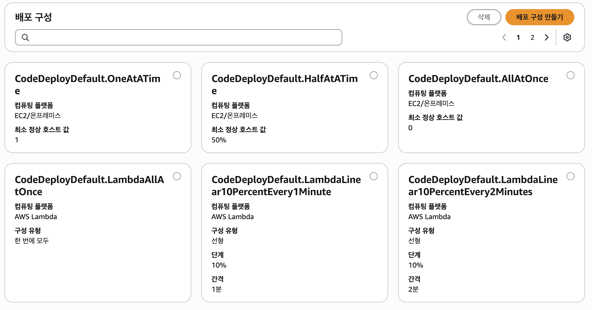

# CodeDeploy

CodeDeploy는 Amazon EC2 인스턴스, 온프레미스 인스턴스, Lambda 또는 Amazon ECS 서비스로 애플리케이션 배포를 자동화하는 배포 서비스입니다.

## Platform

CodeDeploy가 지원하는 컴퓨팅 플랫폼 유형 및 사용가능한 배포 방식은 다음과 같습니다.

- `EC2/온프레미스`
    - [in-place](./001_codedeploy_ec2_inplace/README.md)
    - [blue/green](./002_codedeploy_ec2_bluegreen/README.md)
- `Amazon ECS`
    - [blue/green](./003_codedeploy_ecs_bluegreen/README.md)
- `AWS Lambda`
    - [blue/green](./004_codedeploy_lambda_bluegreen/README.md)

## Component

- **컴퓨팅 플랫폼**
    - CodeDeploy가 애플리케이션을 배포하는 플랫폼(EC2/Lambda/ECS)
- **배포 그룹(인스턴스 집합)**
    - 배포 그룹에는 개별적으로 `태그가 지정된 인스턴스`, `ASG의 Amazon EC2 인스턴스` 또는 둘 다가 포함
- **배포 구성**
    - CodeDeploy에서 사용하는 배포 규칙과 배포 성공 및 실패 조건 집합
    
        - `EC2/온프레미스 컴퓨팅 플랫폼`: 
        해당 배포에 대해 정상 인스턴스의 최소 개수
        - `AWS Lambda 또는 Amazon ECS 컴퓨팅 플랫폼`: 업데이트 된 Lambda 함수 또는 ECS 작업 세트로 트래픽이 라우팅되는 방법
            - Canary
            - Linear
            - All-at-once

- **어플리케이션 개정(수정 버전)**
    - `EC2/온프레미스 배포 개정`: 소스 콘텐츠(소스 코드, 웹 페이지, 실행 파일 및 배포 스크립트)와 애플리케이션 사양 파일(AppSpec 파일)이 포함된 아카이브 파일
        - Amazon S3 버킷 또는 Github 레포에 저장
    - `AWS Lambda 배포 개정`: 배포할 Lambda 함수에 대한 정보를 지정하는 YAML 또는 JSON 형식의 파일
        - Amazon S3 버킷에 저장

- **배포 유형**
    - In-Place or BlueGreen
